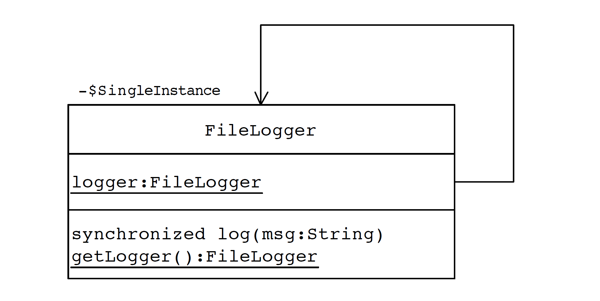

# Singleton Pattern
A singleton pattern is used when there is only needs to be a single isntance of class in form of object available during the life cycle of the application.

 

      
  

### NOTES - JAVA implementation
- Make a private property of type class itself
- Make the constructor private, so it can not be instantiated directly
- Provide a static getter function, so function would be accessible without a need to an object
- Inside the getter check if the property is null, instatiate it and return it, otherwise return the value (Lazy)\
- Instantiate the property on declaration, and inside the getter return the value 